# 🧠 HomeLab-Project-X

## 🚀 Overview

This repository documents my hands-on cybersecurity homelab project built to simulate a real-world enterprise environment.

The goal is to develop practical skills in:

* Network security
* Active Directory
* Threat detection
* Security monitoring

Rather than only learning theory, this project helps me understand how systems are built, attacked, monitored, and defended.

---

## 🏗️ Lab Environment

Current environment includes:

* Windows Server (Domain Controller)
* Windows Client Machines
* Linux Systems
* Kali Linux Attacker Machine
* Security Monitoring Server
* Virtual Network Environment

---

## 🎯 Skills Being Developed

* Windows Administration
* Active Directory Management
* Networking Fundamentals
* Offensive Security Concepts
* SIEM / Log Monitoring
* Detection Engineering
* Troubleshooting

---

## 📊 Progress

* [x] GitHub Project Created
* [x] Virtual Machines Setup
* [x] Network Connectivity
* [x] Domain Controller Deployment
* [x] Wazuh Integration
* [x] Detection Rules
* [ ] Final Documentation

---

## 📁 Project Structure

```bash
docs/
screenshots/
scripts/
notes/
diagrams/
```

---
## NAT Network

### NAT Network Setup
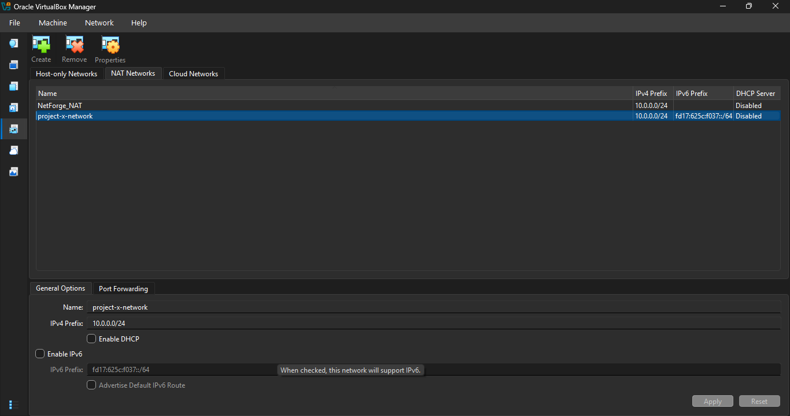

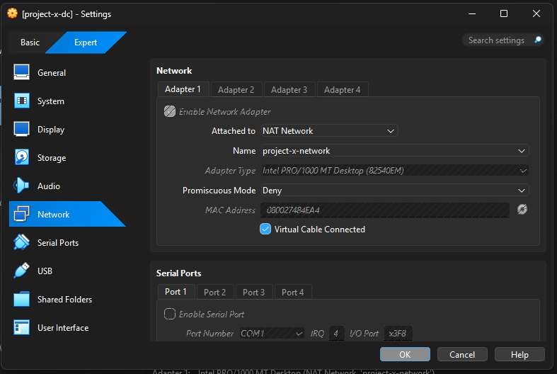


## Domain Controller

### Active Directory Configuration

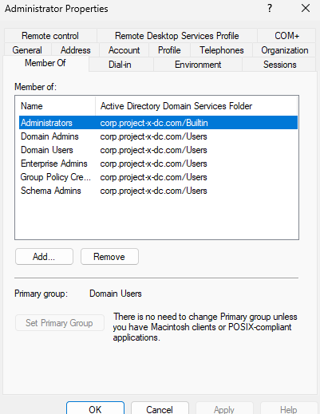

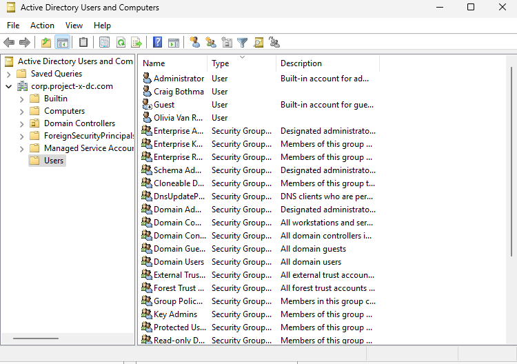

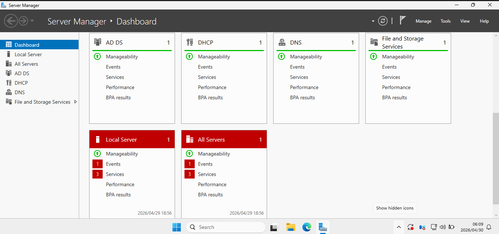

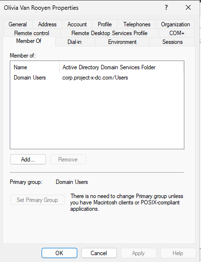

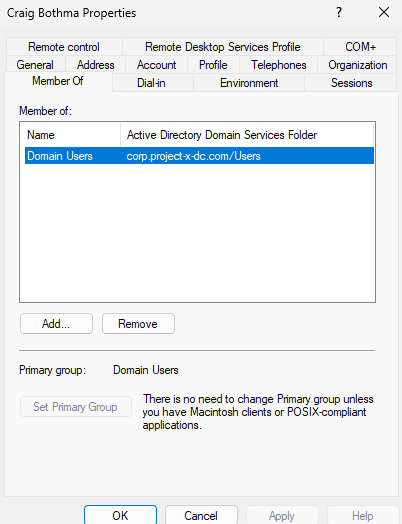

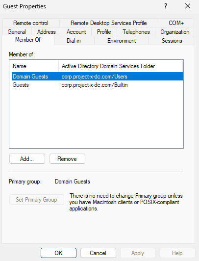

## Wazuh

### Wazuh Dashboard

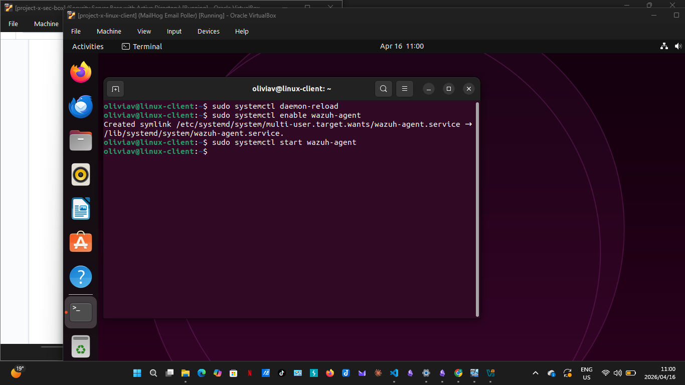

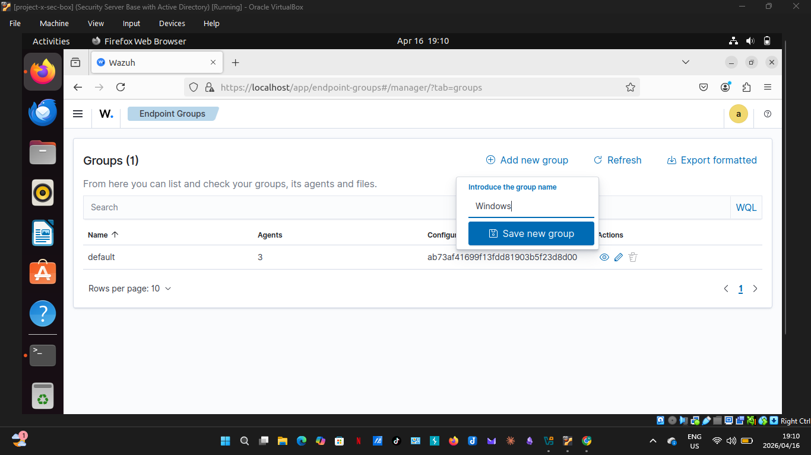

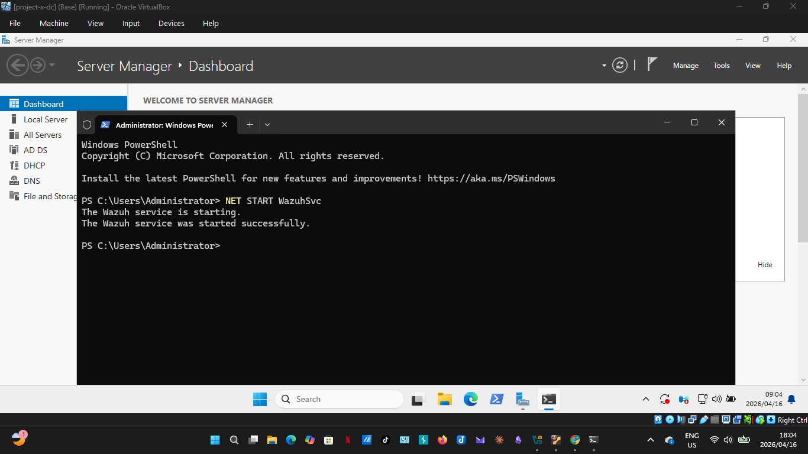

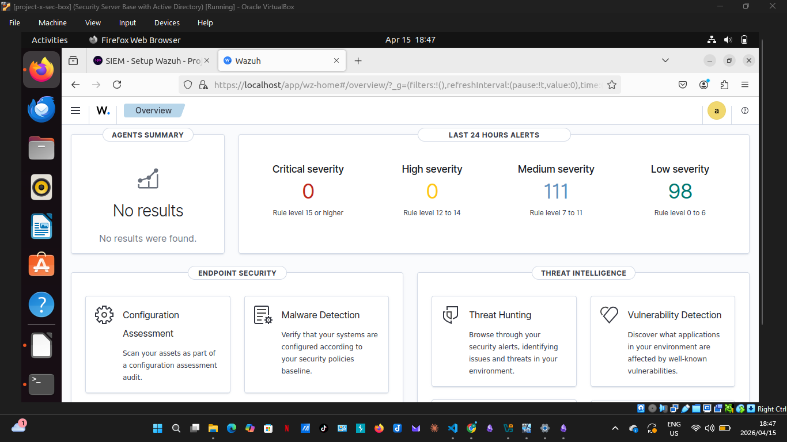

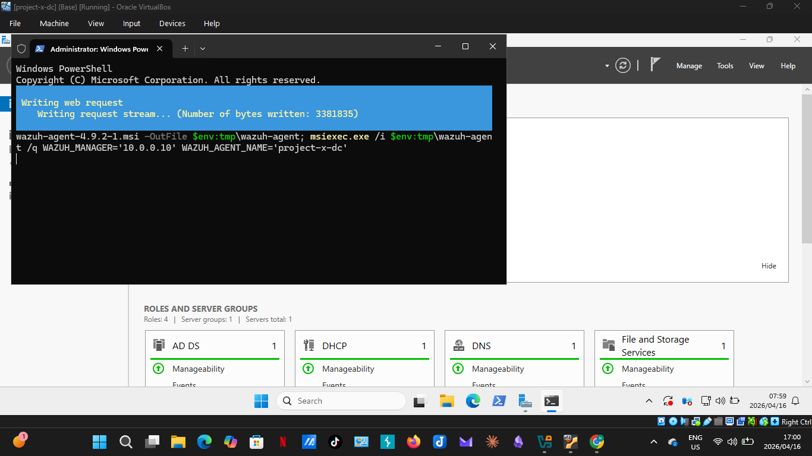

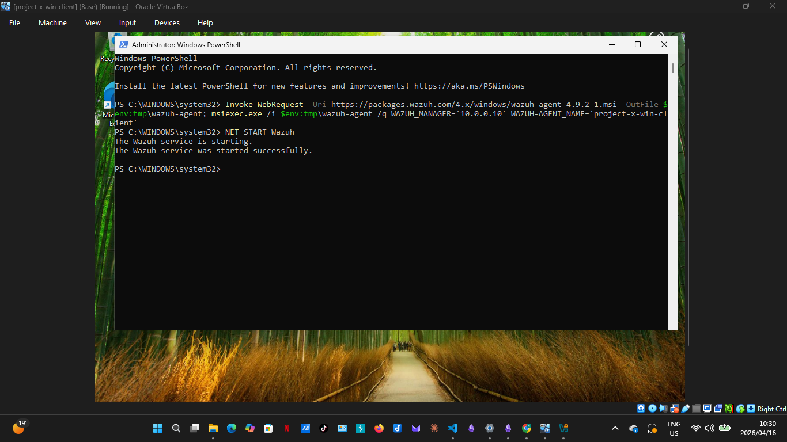


## Client Systems

### Linux Client

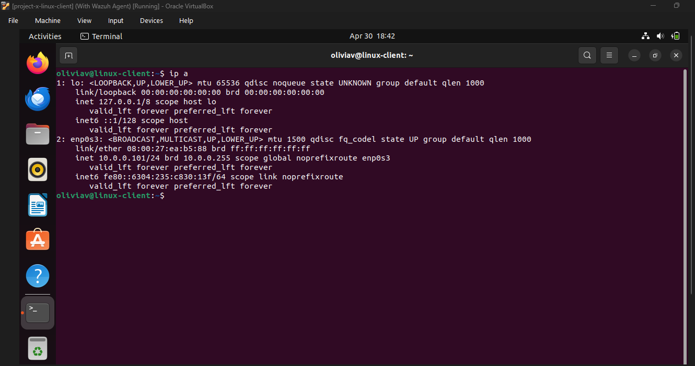

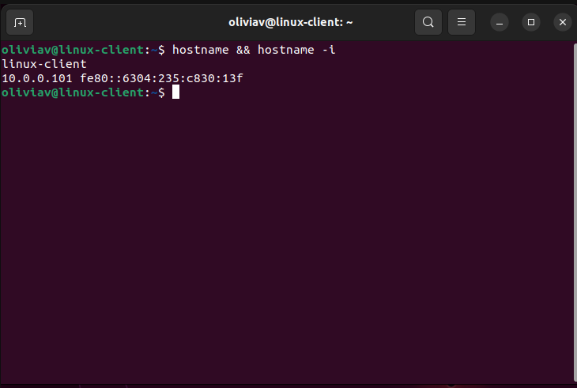

### Windows Client

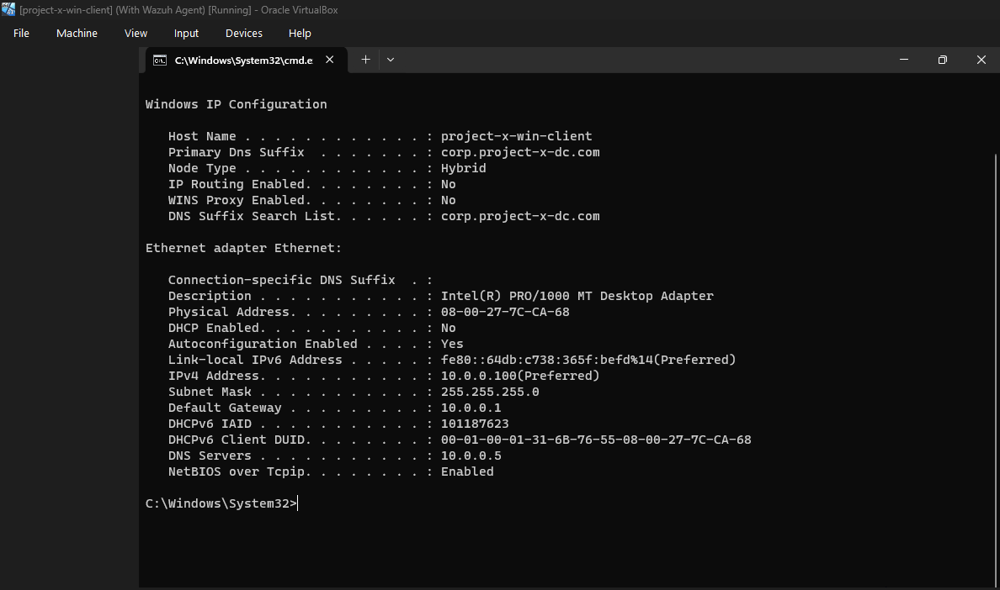


---

## 📌 Purpose

This project represents my transition from theory into practical cybersecurity experience by building and documenting a full lab environment.

---

## 🔄 Continuous Improvement

This repository will grow as I expand the lab, add detections, simulate attacks, and improve defenses.
